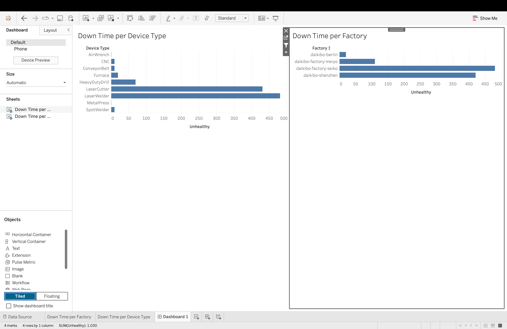
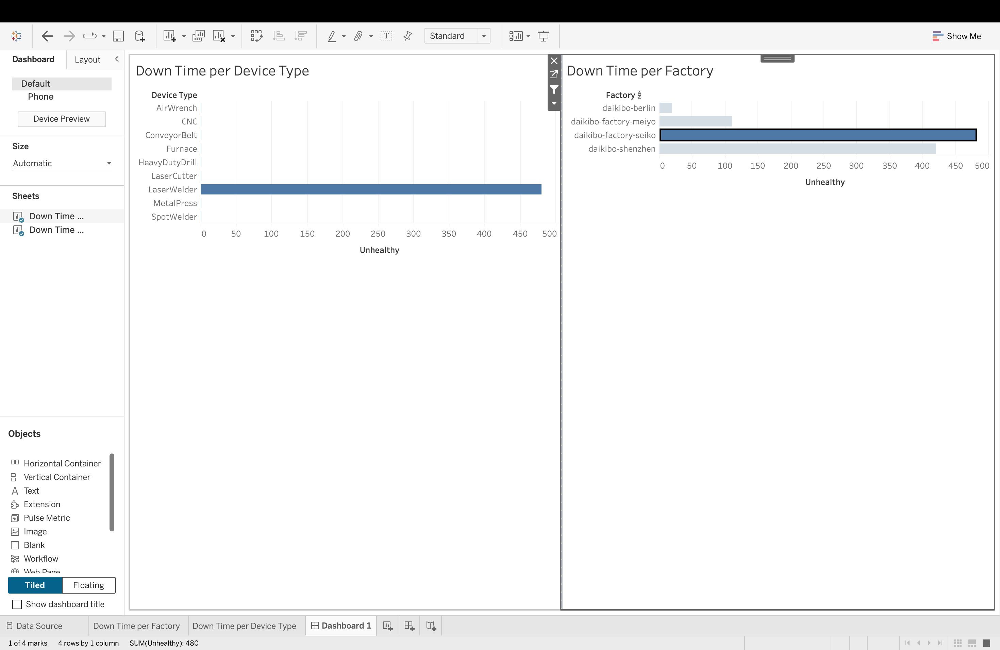
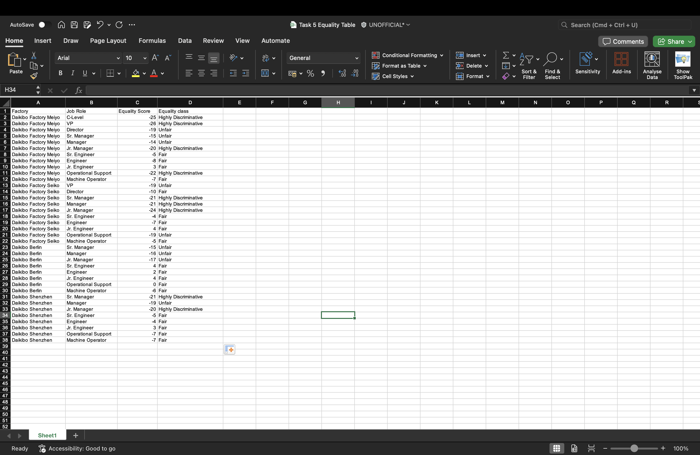

# Deloitte Australia – Data Analytics Job Simulation (Forage)

> A hands-on data analytics project completed through the Deloitte Australia Data Analytics Virtual Experience Program on Forage.

---

# Project Overview

This project demonstrates practical data analytics skills by solving two business problems using **Tableau** and **Microsoft Excel**.

The simulation involved:

- Analyzing industrial telemetry data to identify machine downtime.
- Building an interactive Tableau dashboard for operational insights.
- Applying Excel business logic to classify gender pay equality scores.
- Presenting actionable insights to support business decision-making.

---

# Tools & Technologies

- Tableau Public
- Microsoft Excel
- JSON
- Data Visualization
- Business Intelligence
- Dashboard Design

---

# Project Tasks

## Task 1 – Machine Downtime Analysis

### Business Objective

Analyze telemetry data from Daikibo Industrials to determine:

- Which factory experienced the highest machine downtime.
- Which machine type contributed the most to downtime.

### Dataset

- Industrial Telemetry Data (JSON)
- Machine Status Records

### Methodology

- Imported JSON data into Tableau.
- Created a calculated field to identify unhealthy machine records.
- Developed an interactive dashboard.
- Compared downtime across factories and device types.
- Enabled interactive dashboard filtering for detailed analysis.

### Tableau Calculated Field

```text
IF [Status] = "unhealthy" THEN 10
ELSE 0
END
```

Each unhealthy machine status represents **10 minutes of downtime**.

### Dashboard Features

- Downtime by Factory
- Downtime by Device Type
- Interactive Dashboard Filters
- Comparative Bar Charts

### Key Findings

| Analysis | Result |
|----------|--------|
| Factory with Highest Downtime | **Daikibo Factory Seiko** |
| Device with Highest Downtime | **Laser Welder** |

---

## Task 2 – Gender Pay Equality Analysis

### Business Objective

Classify employee equality scores according to Deloitte's business rules to identify potential pay inequality.

### Tool Used

- Microsoft Excel

### Classification Rules

| Equality Score | Classification |
|----------------|----------------|
| -10 to 10 | Fair |
| -20 to -11 or 11 to 20 | Unfair |
| Less than -20 or Greater than 20 | Highly Discriminative |

### Excel Functions Used

- IF()
- OR()
- AND()

### Outcome

Created an automated classification system that assigns an Equality Class to each employee record based on predefined business rules.

---

# Dashboard Preview

## Machine Downtime Dashboard



---

## Interactive Dashboard



---

## Equality Classification



---

# Skills Demonstrated

- Data Cleaning
- Data Analysis
- Tableau Dashboard Development
- Dashboard Filtering
- Data Visualization
- Business Intelligence
- Microsoft Excel
- Logical Functions (IF, AND, OR)
- Business Problem Solving
- Data Interpretation

---

# Repository Structure

```text
deloitte_data_analytics_job_simulation/
│
├── README.md
├── screenshots/
│   ├── dashboard.png
│   ├── dashboard_selected.png
│   └── equality_table.png
│
├── data/
├── tableau/
└── certificate/
```

---
## Certificate

The project was completed as part of the Deloitte Australia Data Analytics Virtual Experience Program on Forage.

📄  **View Certificate:** [Deloitte Certificate](certificate/Deloitte%20certificate.pdf)
---
# About This Project

This repository showcases work completed as part of the **Deloitte Australia Data Analytics Virtual Experience Program (Forage)**. The project demonstrates practical skills in data visualization, dashboard development, Excel-based business logic, and data-driven decision-making.

---

## Author

**Julie Thuruthiyil Alex**

Master of Information Technology (Data Analytics)  
Griffith University


